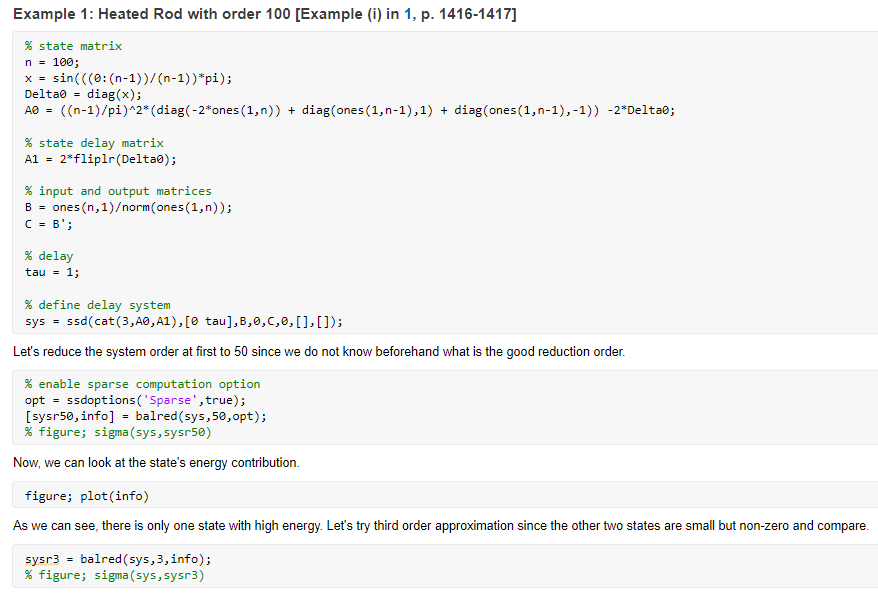
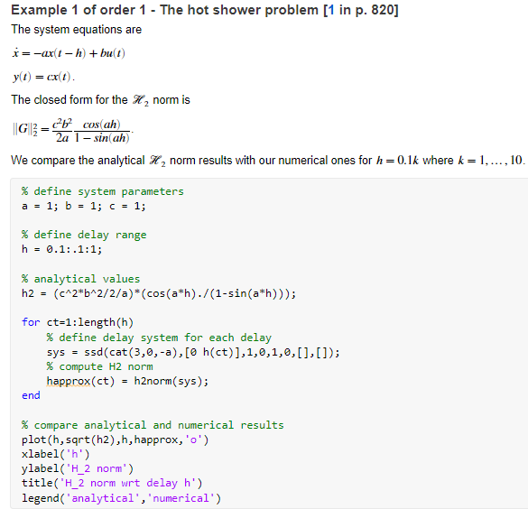

# Software for Delay Systems (SSD)

SSD is a MATLAB package providing the following features and functions for retarded time delay systems:
- **Time and frequency domain visualizations:** step, bode, bodemag, sigma, nyquist.
- **Balanced Reduction:** gram, balreal, balred (standard and frequency-limited).
- **H2 norm computation:** h2norm.

This repo includes
- **one executable notebook, introduction.mlx** and 
- **two executable notebooks, benchmarks_model_reduction.mlx and benchmarks_h2norm.mlx** 

collecting benchmark problems for model reduction and H2 norm computation of delay systems. 

## Installation
Add [src](src) directory to the MATLAB's path.

## Getting started
Check out the executable notebook [introduction.mlx](introduction.mlx) for the overview of the SSD functionalities. A snapshot of the executable notebook can be seen below


## Benchmarks

### Model reduction
The executable notebook [benchmarks_model_reduction.mlx](benchmarks_model_reduction.mlx) collects five benchmark problems.


A snapshot of the executable notebook can be seen below


### H2 norm computation
The executable notebook [benchmarks_h2norm.mlx](benchmarks_h2norm.mlx) collects six benchmark problems.


A snapshot of the executable notebook can be seen below


## License

[MIT License](LICENSE).

## Citations

If you use SSD or any of the benchmarks, please cite our paper:

```
@article{gumussoy:22:ifac_tds,
  title={SSD - Software for Systems with Delays: Reproducable Examples and Benchmarks on Model Reduction and H2 Norm Computation},
  author={Suat Gumussoy},
  journal={submitted to Joint IFAC Conference: SSSC-TDS-LPVS, Montreal, Canada, 2022},
  volume={},
  number={},
  pages={},
  year={},
  publisher={}
}
```
