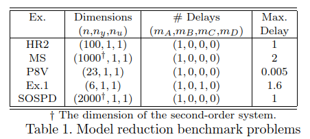
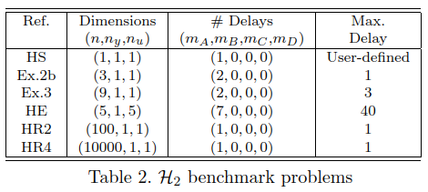

# Software for Delay Systems (SSD) - Coming soon

SSD is a MATLAB package providing the following features and functions for retarded time delay systems:
- **Time and frequency domain visualizations:** step, bode, bodemag, sigma, nyquist.
- **Balanced Reduction:** gram, balreal, balred (standard and frequency-limited).
- **H2 norm computation:** h2norm.

In addition, 

This repo includes **two executable notebooks, benchmarks_model_reduction.mlx and benchmarks_h2norm.mlx** collecting benchmark problems for model reduction and H2 norm computation for delay systems. 

## Installation
Add [src](src) directory to the MATLAB's path.

## Getting started
Check out the executable notebook [introduction.mlx](introduction.mlx) for the overview of the SSD functionalities.

## Benchmarks

### Model reduction
The executable notebook [benchmarks_model_reduction.mlx](benchmarks_model_reduction.mlx) collects five benchmark problems.

### H2 norm computation
The executable notebook [benchmarks_h2norm.mlx](benchmarks_h2norm.mlx) collects six benchmark problems.
